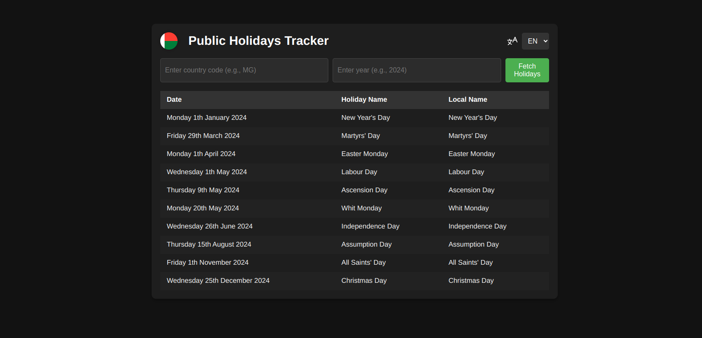

# **Public Holidays Tracker**

Welcome to the **Public Holidays Tracker**, a sleek and simple web application designed to help you stay on top of public holidays around the world. Whether you need to check for holidays in your country or a specific year, this tool makes it easy to stay informed.



### 🚀 **[View the live demo on Netlify](https://your-netlify-link.netlify.app)**
---

## **Features**

- **Track Public Holidays:** Get up-to-date public holidays for any country and year.
- **Language Support:** The app supports both **English** and **French** for an inclusive experience.
- **Country Flags:** Display country flags next to the holiday tracker to make it visually engaging.
- **Responsive Design:** Enjoy a smooth experience on both desktop and mobile devices.
- **Date Format:** Holidays are displayed with localized date formats (e.g., **Monday, 1st January 2024** for English, **Lundi, 1er janvier 2024** for French).
- **Easy Navigation:** The app includes a simple country code input (with autocomplete suggestions) and year selection.

---

## **How It Works**

1. **Enter Country Code**  
   Choose the country code (e.g., `US` for United States, `MG` for Madagascar) using the text input field with autocomplete suggestions.
   
2. **Select Year**  
   You can either manually type in the year or let the app automatically fetch the current year.

3. **Fetch Holidays**  
   Hit the "Fetch Holidays" button to retrieve a list of public holidays for the chosen country and year. The holidays will be displayed in a user-friendly table with dates, names, and local names of the holidays.

4. **Switch Language**  
   Use the dropdown to toggle between English and French. All table data, including holiday names and dates, will be translated accordingly.

---

## **Technologies Used**

- **HTML5** & **CSS3** for the structure and style
- **JavaScript (ES6+)** for dynamic behavior and API interactions
- **Flag API** for country flags
- **Nager.Date Public Holidays API** for fetching holiday data

---

## **How to Run Locally**

If you'd like to run the project locally on your machine, follow these steps:

### 1. Clone the repository

```bash
git clone https://github.com/Ezdev2/public-holiday-check.git
cd public-holidays-tracker
```

### 2. Open `index.html`

You can directly open the `index.html` file in your browser to see the app in action!

---

## **Contribution**

Feel free to fork this repository and make contributions. Whether it’s fixing bugs, improving the UI, adding more countries to the list, or translating into more languages, your help is always appreciated!

1. Fork the repository
2. Create a new branch for your feature (`git checkout -b feature-name`)
3. Commit your changes (`git commit -am 'Add new feature'`)
4. Push to the branch (`git push origin feature-name`)
5. Open a pull request

---

## **Contact**

For any questions or feedback, feel free to open an issue or contact the project maintainer via [fansoaezra@gmail.com](mailto:fansoaezra@gmail.com).

---

### **Example Site Preview**

- **Country Code Input:** Users can type a country code (like `MG` for Madagascar) to see a list of public holidays for that country.
- **Country Flag & Year:** The application dynamically displays the country flag next to the title, and the user can select the desired year for which they want to fetch holidays.
  
Here's what the page might look like when it's running:
  
---

**Public Holidays Tracker**

| Date                         | Holiday Name      | Local Name          |
|------------------------------|-------------------|---------------------|
| Monday, 1st January 2024      | New Year's Day    | Jour de l'An        |
| Friday, 29th March 2024      | Martyrs' Day      | Journée des Martyrs |
| Monday, 1st April 2024       | Easter Monday     | Lundi de Pâques     |
| Wednesday, 1st May 2024      | Labour Day        | Fête du Travail     |
| Thursday, 9th May 2024       | Ascension Day     | L'Ascension         |
| Monday, 20th May 2024        | Whit Monday       | Lundi de Pentecôte  |
| Wednesday, 26th June 2024    | Independence Day  | Fête de l'Indépendance |
| Thursday, 15th August 2024   | Assumption Day    | L'Assomption        |
| Friday, 1st November 2024    | All Saints' Day   | Toussaint           |
| Wednesday, 25th December 2024| Christmas Day     | Noël                |

---

## **Author**

This project was created by **Ezra Fanomezantsoa** (@Ezdev2).  
[GitHub Profile](https://github.com/ezdev2)

---

### 🚀 **[View the live demo on Netlify](https://your-netlify-link.netlify.app)**